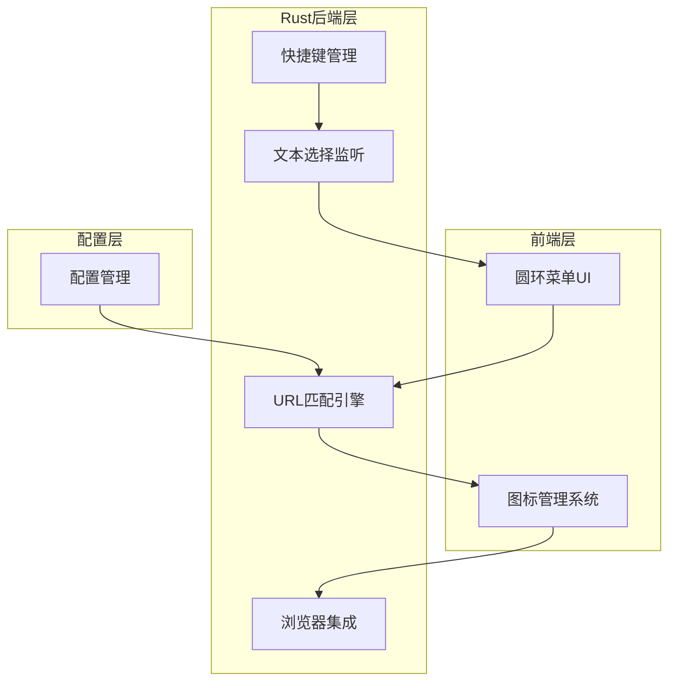
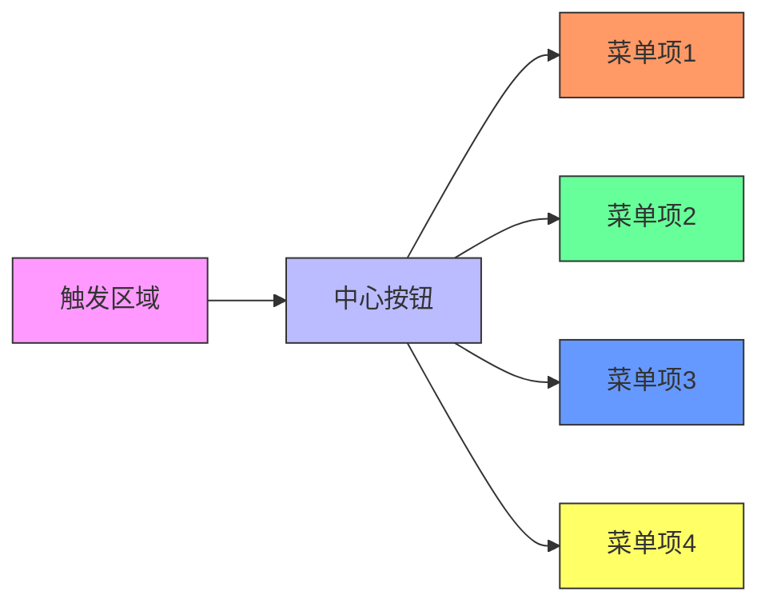
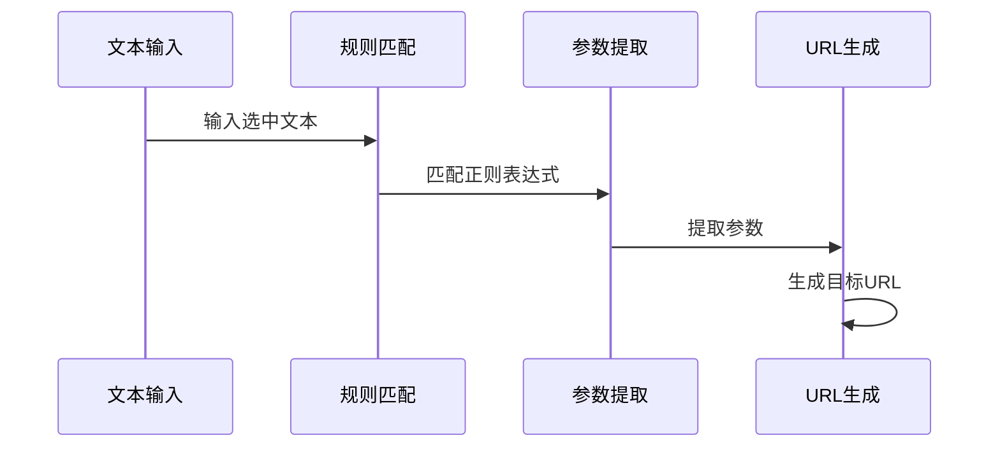

# RingSnap - 架构设计

## 系统架构概览



## 核心组件设计

### 1. 文本选择监听模块

**功能设计：**
- 混合监听方案：剪贴板监听 + 键盘钩子
- 全局快捷键：Ctrl+Shift+C (Windows/Linux) / Cmd+Shift+C (macOS)
- 智能文本处理

**跨平台实现：**
```rust
// src-tauri/src/clipboard.rs

#[cfg(target_os = "windows")]
fn listen_clipboard() {
    // Windows: 使用WinAPI SetWindowsHookEx
    use winapi::um::winuser::{SetWindowsHookExW, WH_KEYBOARD_LL};
}

#[cfg(target_os = "macos")]
fn listen_clipboard() {
    // macOS: 使用NSPasteboard
    use cocoa::appkit::NSPasteboard;
}

#[cfg(target_os = "linux")]
fn listen_clipboard() {
    // Linux: 使用Xlib
    use xlib::Display;
}
```

### 2. 圆环菜单UI组件

**视觉设计：**


**交互设计：**
- 鼠标点击选择
- 键盘数字键选择 (1-9)
- 鼠标悬停提示
- 动画过渡效果

### 3. URL匹配引擎

**匹配流程：**


**规则配置示例：**
```json
{
  "rules": [
    {
      "name": "GitHub仓库",
      "pattern": "github\\.com\\/([^\\/]+)\\/([^\\/]+)",
      "url": "https://github.com/{1}/{2}",
      "icon": "github.com"
    },
    {
      "name": "Baidu搜索",
      "pattern": "baidu\\.com\\/s\\?wd=([^&]+)",
      "url": "https://www.baidu.com/s?wd={1}",
      "icon": "baidu.com"
    },
    {
      "name": "Google搜索",
      "pattern": "google\\.com\\/search\\?q=([^&]+)",
      "url": "https://www.google.com/search?q={1}",
      "icon": "google.com"
    }
  ]
}
```

### 4. 图标管理系统

**工作流程：**
1. 从配置获取图标域名
2. 使用Google favicon服务获取图标
3. 调整大小和格式
4. 缓存管理
5. 错误处理和备用图标

**缓存策略：**
- 内存缓存：常用图标
- 磁盘缓存：所有图标
- 缓存过期：7天

### 5. 浏览器集成

**跨平台命令：**
- Windows: `start https://example.com`
- macOS: `open https://example.com`
- Linux: `xdg-open https://example.com`

**错误处理：**
- 浏览器未安装
- 无效URL格式
- 网络连接问题

## 性能优化

### 内存管理
- 图标缓存大小限制
- 规则匹配结果缓存
- 垃圾回收策略

### 响应性能
- 异步图标加载
- 规则匹配优化
- UI渲染优化

## 安全性考虑

### 输入验证
- URL格式验证
- 正则表达式安全
- 命令注入防护

### 权限管理
- 最小权限原则
- 安全沙箱
- 用户确认机制

## 可扩展性设计

### 插件系统
- 自定义匹配规则
- 自定义图标源
- 自定义浏览器行为

### 配置热更新
- 文件监听
- 实时重载
- 错误恢复

## 测试策略

### 单元测试
- URL匹配引擎
- 图标加载器
- 配置管理器

### 集成测试
- 端到端流程
- 跨平台测试
- 性能测试

## 部署方案

### 构建配置
```toml
# src-tauri/Cargo.toml
[package]
name = "text-selection-tool"
version = "0.1.0"

[dependencies]
tauri = { version = "1.0", features = ["api-all"] }
serde = { version = "1.0", features = ["derive"] }
serde_json = "1.0"
```

### 发布流程
1. 版本号更新
2. 构建多平台包
3. 生成安装程序
4. 发布到应用商店

## 维护计划

### 监控
- 错误日志
- 使用统计
- 性能监控

### 更新
- 自动更新
- 增量更新
- 回滚机制

这个架构设计涵盖了所有需求功能，并考虑了性能、安全性和可扩展性。现在可以进入代码实现阶段。